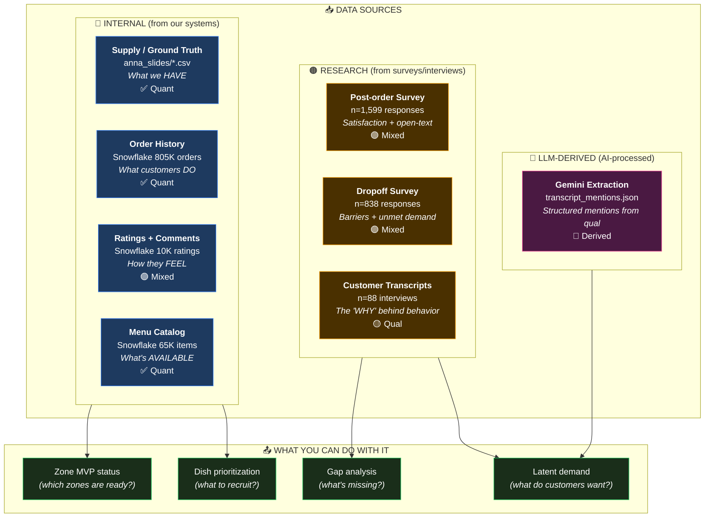

# Dinneroo Data Types - Quick Reference

## How to read this diagram

---

## Quick Legend

| Symbol | Meaning |
|--------|---------|
| ✅ **Quant** | Numbers, counts, metrics (can aggregate) |
| 🟡 **Qual** | Text, transcripts, context (rich but not countable) |
| 🟣 **Mixed** | Has both (e.g. survey with ratings + open-text) |
| 🩷 **Derived** | LLM turned qual into structured data |

| Source | What it means |
|--------|---------------|
| 🔵 **Internal** | From Deliveroo systems (Snowflake, Anna exports) |
| 🟠 **Research** | From surveys or customer interviews |
| 🩷 **LLM** | AI-processed (Gemini extraction with audit trail) |

---

## Key Rules

1. **Supply ≠ Performance** — Anna tells you what EXISTS, Snowflake tells you how it PERFORMS
2. **Never use OG Survey alone** — always triangulate with other sources
3. **LLM outputs are assistive** — use the audit trail, don't treat as ground truth
4. **Open-text is gold** — surveys have quant scores AND qual insights

---

## Common Questions → Which Data to Use

| Question | Primary Source | Why |
|----------|---------------|-----|
| "How many partners in Zone X?" | Anna supply data | Ground truth for supply |
| "What's the repeat rate?" | Snowflake orders | Revealed behavior |
| "Why do families drop off?" | Dropoff survey | Direct barrier questions |
| "What dishes do families want?" | Transcripts + LLM extraction | Unprompted mentions |
| "Is Zone X ready for launch?" | Zone MVP status (derived) | Combines multiple sources |

