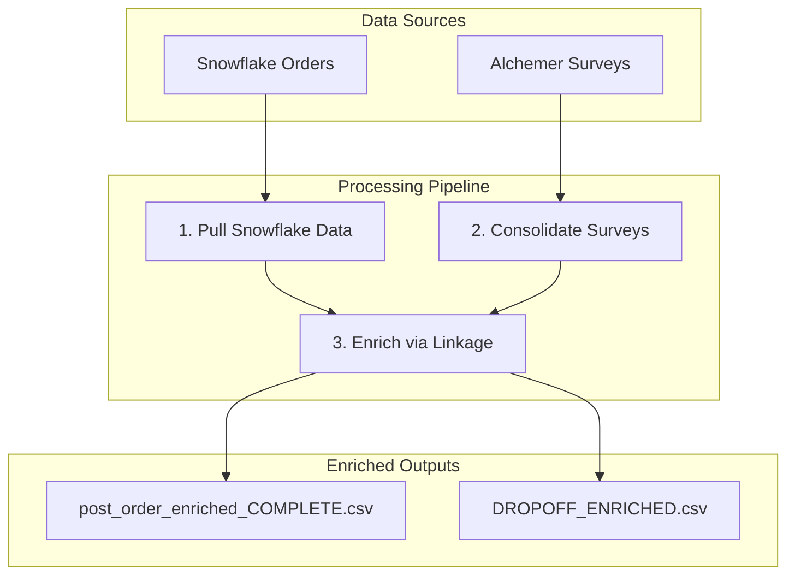

# User ID to Survey Response Linkage Guide

## Purpose

This guide documents the process used in the Dinneroo project to connect customer identities (User IDs and emails) from Snowflake order data to survey responses collected via Alchemer. This enables us to enrich survey feedback with actual behavioral data (order history, ratings, zone, dishes ordered).

---

## Data Flow Architecture



---

## Step 1: Pull Customer Data from Snowflake

### Script

`integrations/snowflake_connector.py`

### How It Works

The Snowflake connector pulls Dinneroo order data with customer identifiers by joining the orders table with the users table:

```sql
SELECT 
    o.ID AS ORDER_ID,
    o.USER_ID AS CUSTOMER_ID,
    u.EMAIL AS CUSTOMER_EMAIL,
    o.RESTAURANT_NAME AS PARTNER_NAME,
    o.CREATED_AT AS ORDER_TIMESTAMP,
    o.ZONE_NAME,
    o.MENU_ITEM_LIST,
    ...
FROM production.denormalised.orders o
LEFT JOIN production.orderweb.users u ON o.USER_ID = u.ID
WHERE o.IS_FAMILY_TIME_ORDER = TRUE
  AND o.STATUS = 'DELIVERED'
```

### Key Details

- **Join:** Links `orders` to `users` via `USER_ID` to get `EMAIL`
- **Filter:** Only Dinneroo orders (`IS_FAMILY_TIME_ORDER = TRUE`)
- **Output:** `DATA/1_SOURCE/snowflake/ALL_DINNEROO_ORDERS.csv`

### Key Columns for Linkage

| Column | Purpose |
|--------|---------|
| `CUSTOMER_ID` | Internal Deliveroo User ID |
| `CUSTOMER_EMAIL` | Email for matching to surveys |
| `ORDER_ID` | Unique order identifier |
| `ORDER_TIMESTAMP` | For date-proximity matching |
| `PARTNER_NAME` | For brand-based fallback matching |

### Running the Data Pull

```bash
python scripts/refresh_snowflake_data.py
```

This opens a browser window for SSO authentication, then pulls:
- `ALL_DINNEROO_ORDERS.csv` - All Dinneroo orders with customer emails
- `ALL_DINNEROO_CUSTOMERS.csv` - Customer-level metrics
- `DINNEROO_RATINGS.csv` - Order ratings and comments
- Plus catalog and performance data

---

## Step 2: Consolidate Survey Responses

### Script

`scripts/phase1_data/04_consolidate_surveys.py`

### How It Works

Surveys are exported from Alchemer as CSV files. This script:

1. Loads existing consolidated survey file (if any)
2. Loads new Alchemer export
3. Merges and deduplicates on `Response ID`
4. Saves updated consolidated file

### Survey Email Field

The survey asks respondents for their email with this question:
> "Please provide your Deliveroo email address so that we can send you the voucher!"

This email is the primary linkage key to Snowflake data.

### Running Consolidation

```bash
python scripts/phase1_data/04_consolidate_surveys.py --all
```

Options:
- `--all` - Consolidate all surveys
- `--post-order` - Post-order survey only
- `--dropoff` - Dropoff survey only

### Outputs

| Survey | Consolidated File |
|--------|-------------------|
| Post-Order | `DATA/1_SOURCE/surveys/POST_ORDER_SURVEY-CONSOLIDATED.csv` |
| Dropoff | `DATA/1_SOURCE/surveys/DROPOFF_SURVEY-CONSOLIDATED.csv` |

---

## Step 3: Link Survey Responses to Order Data

### Script

`scripts/phase1_data/05_enrich_surveys.py`

### Linkage Strategy (Confidence Hierarchy)

The script attempts to match each survey response to a Snowflake order using a tiered confidence approach:

| Priority | Method | Confidence | Logic |
|----------|--------|------------|-------|
| 1 | `email_brand_date` | **Highest** | Email matches + restaurant brand matches + order 0-7 days before survey |
| 2 | `email_date` | High | Email matches + order 0-7 days before survey |
| 3 | `email_only` | Medium | Email matches, use most recent order |
| 4 | `brand_date` | Low | Restaurant brand + date match (may match wrong customer) |
| 5 | `unmatched` | None | No linkage possible |

### Key Functions

#### 1. Email Normalization

```python
def normalize_email(email):
    """Normalize email for matching."""
    if pd.isna(email) or not isinstance(email, str):
        return None
    return email.lower().strip()
```

#### 2. Brand Name Normalization

```python
def normalize_brand_name(name):
    """
    Normalize restaurant/brand name for matching.
    Extracts the brand from full partner names like "Pho - Bristol" -> "pho"
    """
    if pd.isna(name) or not isinstance(name, str):
        return None
    
    name = name.lower().strip()
    
    # Extract brand name (before any " - " separator)
    if ' - ' in name:
        name = name.split(' - ')[0].strip()
    
    return name
```

#### 3. Email Index Builder

```python
def build_email_to_orders_index(orders_df):
    """
    Build an index of email -> list of orders for fast lookup.
    Returns dict: {normalized_email: [order_rows]}
    """
```

This creates a dictionary for O(1) lookups by email address.

#### 4. Best Match Finder

```python
def find_best_order_match(survey_email, survey_date, survey_brand, 
                          email_index, brand_date_index, date_tolerance_days=1):
    """
    Find the best matching order for a survey response.
    Returns: (order_row, linkage_method) or (None, 'unmatched')
    """
```

### Date Matching Logic

Orders are considered valid matches if they occurred **0-7 days before** the survey submission:

```python
days_diff = (survey_date_ts - order_date).days
if 0 <= days_diff <= 7:  # Order was 0-7 days before survey
    matching_orders.append((order, days_diff))
```

The most recent matching order (smallest `days_diff`) is preferred.

### Enriched Fields Added

When a match is found, these fields are added to the survey response:

| Field | Source | Description |
|-------|--------|-------------|
| `ORDER_ID` | Matched order | Unique order identifier |
| `USER_ID` | Orders table | Deliveroo Customer ID |
| `USER_EMAIL` | Orders table | Customer email |
| `LINKAGE_METHOD` | Enrichment | Which strategy succeeded |
| `ORDER_TIMESTAMP` | Orders table | When order was placed |
| `PARTNER_NAME` | Orders table | Restaurant name |
| `ORDER_VALUE` | Orders table | Order total |
| `ZONE_NAME` | Orders table | Delivery zone |
| `MENU_ITEM_LIST` | Orders table | Items ordered |
| `RATING_STARS` | Ratings table | Customer rating (1-5) |
| `RATING_COMMENT` | Ratings table | Rating text feedback |
| `RATING_TAGS` | Ratings table | Issue categories |

### Derived Metrics

The enrichment script also calculates:

| Metric | Logic |
|--------|-------|
| `NUM_CHILDREN_NUMERIC` | Count of child age columns with values |
| `Is_Family` | Has children OR ordered for family |
| `Is_Satisfied` | Rating is "Very Satisfied" or "Satisfied" |
| `Days_To_Survey` | Days between order and survey submission |
| `Strong_Advocate` | Would reorder + satisfied |

### Running Enrichment

```bash
python scripts/phase1_data/05_enrich_surveys.py --all
```

Options:
- `--all` - Enrich all surveys
- `--post-order` - Post-order survey only
- `--dropoff` - Dropoff survey only

### Outputs

| Survey | Enriched File |
|--------|---------------|
| Post-Order | `DATA/2_ENRICHED/post_order_enriched_COMPLETE.csv` |
| Dropoff | `DATA/2_ENRICHED/DROPOFF_ENRICHED.csv` |

---

## Step 4: Complete Pipeline

### Full Refresh Command Sequence

```bash
# 1. Pull fresh data from Snowflake (requires SSO)
python scripts/refresh_snowflake_data.py

# 2. Consolidate survey exports from Alchemer
python scripts/phase1_data/04_consolidate_surveys.py --all

# 3. Enrich surveys with Snowflake linkage
python scripts/phase1_data/05_enrich_surveys.py --all
```

### Automation Note

For automated pipelines, the Snowflake connector supports key-pair authentication:

```python
connector = SnowflakeConnector(auth_method='keypair')
```

Set environment variables:
- `SNOWFLAKE_PRIVATE_KEY_PATH` - Path to private key file
- `SNOWFLAKE_PRIVATE_KEY_PASSPHRASE` - Key passphrase (optional)

---

## Match Rate Analysis

### Typical Linkage Breakdown

Based on historical runs, approximate match rates:

| Linkage Method | Typical % | Notes |
|----------------|-----------|-------|
| `email_brand_date` | 40-50% | Best quality matches |
| `email_date` | 20-30% | Good quality, brand mismatch (typos, etc.) |
| `email_only` | 5-10% | Older orders, timing gap |
| `brand_date` | 5-10% | Fallback, lower confidence |
| `unmatched` | 10-20% | No email provided or email not in Snowflake |

### Why Matches Fail

1. **No email provided** - Respondent skipped email field
2. **Different email** - Used different email for survey vs Deliveroo account
3. **New customer** - Placed first order, not yet in historical data
4. **Timing gap** - Order was >7 days before survey
5. **Data lag** - Snowflake data not yet refreshed

---

## Key Files Reference

| Purpose | Path |
|---------|------|
| Snowflake connector | `integrations/snowflake_connector.py` |
| Data refresh script | `scripts/refresh_snowflake_data.py` |
| Survey consolidation | `scripts/phase1_data/04_consolidate_surveys.py` |
| Survey enrichment | `scripts/phase1_data/05_enrich_surveys.py` |
| Raw orders | `DATA/1_SOURCE/snowflake/ALL_DINNEROO_ORDERS.csv` |
| Raw customers | `DATA/1_SOURCE/snowflake/ALL_DINNEROO_CUSTOMERS.csv` |
| Raw ratings | `DATA/1_SOURCE/snowflake/DINNEROO_RATINGS.csv` |
| Consolidated post-order | `DATA/1_SOURCE/surveys/POST_ORDER_SURVEY-CONSOLIDATED.csv` |
| Consolidated dropoff | `DATA/1_SOURCE/surveys/DROPOFF_SURVEY-CONSOLIDATED.csv` |
| Enriched post-order | `DATA/2_ENRICHED/post_order_enriched_COMPLETE.csv` |
| Enriched dropoff | `DATA/2_ENRICHED/DROPOFF_ENRICHED.csv` |

---

## Important Considerations

### Data Quality

1. **Email is the primary linkage key** - Survey respondents must provide their Deliveroo email for linkage to work
2. **Date proximity matters** - Orders 0-7 days before survey are considered; adjust tolerance if needed
3. **Brand validation increases confidence** - If restaurant in survey matches order, higher trust in match
4. **Unmatched responses are preserved** - Survey data is retained even without order linkage

### Privacy & Compliance

1. **GDPR compliance** - Email data only used for internal analysis linkage
2. **Data minimization** - Only necessary fields are pulled from Snowflake
3. **Access control** - Snowflake access requires authenticated credentials
4. **No PII in outputs** - Enriched files should not be shared externally with raw emails

### Troubleshooting

| Issue | Likely Cause | Solution |
|-------|--------------|----------|
| Low match rate | Stale Snowflake data | Run `refresh_snowflake_data.py` |
| Missing `CUSTOMER_EMAIL` | Query not joining users table | Check connector query |
| All `brand_date` matches | Email column not found | Check survey email field name |
| Zero matches | Wrong file paths | Verify `DATA/1_SOURCE/` structure |

---

## Extending the Linkage

### Adding New Survey Types

To add linkage for a new survey:

1. Add consolidation logic to `04_consolidate_surveys.py`
2. Add enrichment function to `05_enrich_surveys.py`
3. Identify the email field in the new survey
4. Define appropriate derived metrics

### Improving Match Rates

Consider these enhancements:

- **Fuzzy email matching** - Handle typos with Levenshtein distance
- **Phone number linkage** - Secondary identifier if available
- **Order ID in survey** - Add hidden field with order ID to survey URL

---

*Last updated: January 2026*
